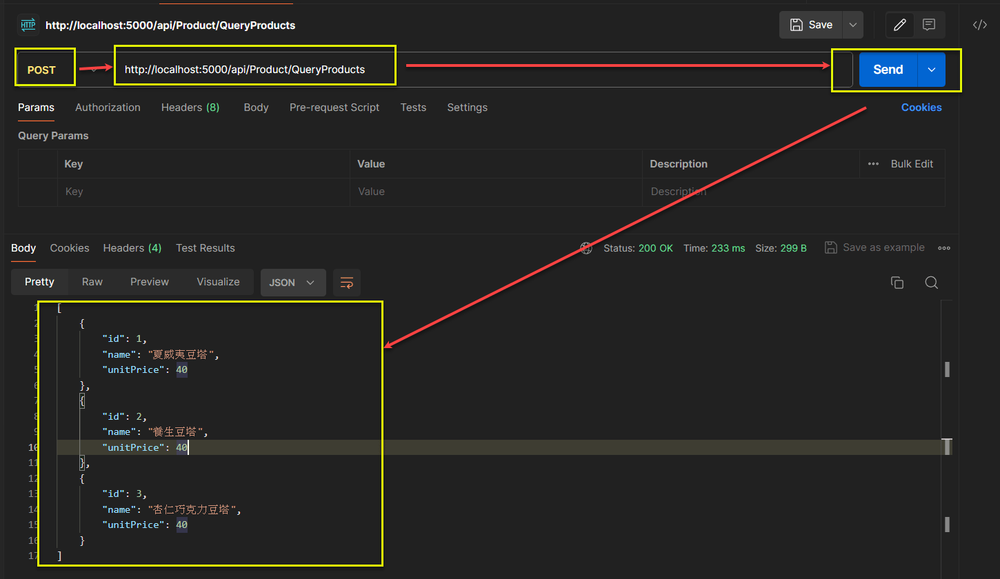

# 如何在使用者登入後, 自動執行含有 ASP.NET Core 8 Web API 的 Windows Form 應用程式 (含TrayIcon)

## How to Auto-Execute Windows Form App (TrayIcon) containing ASP.NET Core 8 Web API after User Login

前一篇把背景服務整合至使用者登入後的 TrayIcon 應用程式, 且確認可在使用者登入後執行. 而 ASP.NET Core 8 Web API 其實也類似一個背景服務, 想說看看是否可以作到.  

試想一個情境:  
想在瀏覽器的 Javascript 存取使用者的本機資源, 例如: 讀卡機, 描描器, 印表機, 本機環境設定... 等, 受限瀏覽器安全性設計, 應該很難作到. 或許可以, 但筆者不是 Javascript 專家, 想說是否有其它的路可以走. 看到 <a href="https://blog.darkthread.net/blog/net6-windows-service/" target="_blank">(黑暗執行緒) 使用 .NET 6 開發 Windows Service</a> 有人詢問瀏覽器存取本機資源的問題, 黑大回覆可以參考這篇 <a href="https://learn.microsoft.com/zh-tw/aspnet/core/host-and-deploy/windows-service?view=aspnetcore-8.0&tabs=visual-studio" target="_blank">(Microsoft) 在 Windows 服務上裝載 ASP.NET Core</a>.  

架構設計如下圖, 但不是真的去讀 ICCard, 只是作一個小的 Web API 驗證可行性.  


筆者的狀況是不一定要裝載在 Windows Service, 只要是登入後執行的 Windows Form App, 且自動縮小到系統匣(System Tray) 即可.  

一. [建立 ASP.NET Core 8 Web API 應用程式](#section1)  
(一) [建立 ASP.NET Core 8 Web API 專案](#section1-1)  
(二) [加入範例 Web API](#section1-2)  
(三) [採用 Serilog 輸出至 Console 及 File](#section1-3)  
二. [發佈前述 ASP.NET Core 8 Web API 至單一執行檔](#section2)   
(一) [以 VS2022 進行發佈](#section2-1)   
(二) [以 Postman 測試發佈後的執行檔](#section2-2)  
三. [加入 TrayIcon 的功能](#section3)  
(一) [加入 icon 圖檔](#section3-1)  
(二) [建立一個 Windows Form App 作為修訂 Web API 專案的參考](#section3-2)  
(三) [修改 .csproj](#section3-3)  
(四) [修訂其它程式](#section3-4)  
四. [實際測試](#section4)  
(一) [TrayIcon 模式](#section4-1)   
(二) [Console 模式](#section4-2)   
五. [安全性議題](#section5)  
(一) [AllowHosts 設置](#section5-1)  
(二) [CORS 設置](#section5-2)  
(三) [調整後的 Program.cs](#section5-3)  
六. [注意事項](#section6)  

<a href="https://github.com/jasper-lai/20240404_ASPNETCore8APITrayIcon" target="_blank">範例由此下載</a> .  

<!-- more -->

## 一. 建立 ASP.NET Core 8 Web API 應用程式 <a id="section1"></a>

### (一) 建立 ASP.NET Core 8 Web API 專案 <a id="section1-1"></a>
過程應該不難, 如為新手朋友, 可以參考 <a href="https://learn.microsoft.com/en-us/aspnet/core/tutorials/first-web-api?view=aspnetcore-8.0&tabs=visual-studio" target="_blank">(Microsoft) Tutorial: Create a web API with ASP.NET Core</a>  

### (二) 加入範例 Web API <a id="section1-2"></a>

1.. ProductViewModel:  

```csharp
public class ProductViewModel : IValidatableObject
{
    [Display(Name = "產品代號")]
    [Required(ErrorMessage = "{0} 必須要有值")]
    public int Id { get; set; }

    [Display(Name = "產品名稱")]
    [Required(ErrorMessage = "{0} 必須要有值")]
    [StringLength(10, ErrorMessage = "產品名稱長度最多為 10 個字元")]
    public string Name { get; set; } = string.Empty;

    [Display(Name = "產品單價")]
    public int UnitPrice { get; set; }

    /// <summary>
    /// Validates the specified validation context.
    /// </summary>
    /// <param name="validationContext">The validation context.</param>
    /// <remarks>
    /// 重要: 只有在前述的 Validation Attribute 都通過以後, 才會執行這裡的檢核.
    /// 亦即: (1) Validation Attribute 有誤, 前端只會看到 Validation Attribute 的錯誤.
    ///       (2) Validation Attribute 正確, 前端才看到以下的錯誤.   
    /// </remarks>
    /// <returns></returns>
    public IEnumerable<ValidationResult> Validate(ValidationContext validationContext)
    {
        // Custom validation logic for UnitPrice
        if (UnitPrice < 1 || UnitPrice > 1000)
        {
            string[] memberNames = [nameof(UnitPrice)];
            yield return new ValidationResult("產品單價必須在 1 ~ 1000", memberNames);
        }
    }
}
```

2.. ProductController:  

```csharp
[Route("api/[controller]/[action]")]
[ApiController]
public class ProductController : ControllerBase
{
    private readonly List<ProductViewModel> _products;
    private readonly ILogger<ProductController> _logger;

    public ProductController(ILogger<ProductController> logger)
    {
        _products =
        [
            new ProductViewModel { Id = 1, Name = "夏威夷豆塔", UnitPrice = 40},
            new ProductViewModel { Id = 2, Name = "養生豆塔", UnitPrice = 40},
            new ProductViewModel { Id = 3, Name = "杏仁巧克力豆塔", UnitPrice = 40},
            new ProductViewModel { Id = 4, Name = "原味奶酪", UnitPrice = 50},
            new ProductViewModel { Id = 5, Name = "原味瑪德蓮", UnitPrice = 30},
            new ProductViewModel { Id = 6, Name = "費南雪", UnitPrice = 30}
        ];
        _logger = logger;
    }

    /// <summary>
    /// 依產品名稱, 取得符合條件的產品清單
    /// </summary>
    /// <returns></returns>
    /// <remarks>
    /// [發佈前] http://localhost:5137/api/Product/QueryProducts
    /// [發佈後] http://localhost:5000/api/Product/QueryProducts
    /// </remarks>
    [HttpPost]
    public async Task<ActionResult<IEnumerable<ProductViewModel>>> QueryProducts(string name = "豆塔")
    {
        var result = _products.Where(x => x.Name.Contains(name)).ToList();
        _logger.LogInformation("{@products}", result);
        return await Task.FromResult(result);
    }
}
```

### (三) 採用 Serilog 輸出至 Console 及 File <a id="section1-3"></a>

1.. 加入 nuget 套件: Serilog.AspNetCore .  

2.. 修改 Program.cs:  
主要是以下 #region ... #endregion 的內容.  

```csharp
using Serilog.Events;
using Serilog;

#region Serilog 的設置
// 設置
Log.Logger = new LoggerConfiguration()
    .MinimumLevel.Information()
    .MinimumLevel.Override("Microsoft.AspNetCore", LogEventLevel.Warning)
    .Enrich.FromLogContext()
    .WriteTo.Console()
    .WriteTo.File("D:/Temp/logs/WebApi-.txt", rollingInterval: RollingInterval.Day)
    .CreateLogger();
#endregion

var builder = WebApplication.CreateBuilder(args);

#region 採用 Serilog 作為 Log 的工具
// Configure your application
builder.Logging.ClearProviders(); // Clear default logging providers
builder.Logging.AddSerilog(); // Use Serilog for logging
#endregion

// Add services to the container.
builder.Services.AddControllers();
// Learn more about configuring Swagger/OpenAPI at https://aka.ms/aspnetcore/swashbuckle
builder.Services.AddEndpointsApiExplorer();
builder.Services.AddSwaggerGen();

var app = builder.Build();

// Configure the HTTP request pipeline.
if (app.Environment.IsDevelopment())
{
    app.UseSwagger();
    app.UseSwaggerUI();
}

#region 暫時先不作 Http 轉向至 Https
// app.UseHttpsRedirection();
#endregion

app.UseAuthorization();
app.MapControllers();
app.Run();
```

## 二. 發佈前述 ASP.NET Core 8 Web Api 至單一執行檔 <a id="section2"></a>

### (一) 以 VS2022 進行發佈 <a id="section2-1"></a>

1.. 發佈的細節.  
  

2.. 發佈的結果.  
  

### (二) 以 Postman 測試發佈後的執行檔 <a id="section2-2"></a>

1.. 執行 ASPNETCore8APITrayIcon.exe  
可以發現是 listen 在 port 5000.  
  

2.. 以 Postman 測試該 Web API.  
可以發現正常執行無誤.  
  

可以發現 Console 及 File 都有正常輸出 Log.  
  

## 三. 加入 TrayIcon 的功能 <a id="section3"></a>

### (一) 加入 icon 圖檔 <a id="section3-1"></a>
  

### (二) 建立一個 Windows Form App 作為修訂 Web API 專案的參考 <a id="section3-2"></a>

1.. Windows From 的 .csproj  
```xml
<Project Sdk="Microsoft.NET.Sdk">
  <PropertyGroup>
    <OutputType>WinExe</OutputType>
    <TargetFramework>net8.0-windows</TargetFramework>
    <Nullable>enable</Nullable>
    <UseWindowsForms>true</UseWindowsForms>
    <ImplicitUsings>enable</ImplicitUsings>
  </PropertyGroup>
</Project>
```

2.. Windows From 的 Program.cs  
```csharp
internal static class Program
{
    /// <summary>
    ///  The main entry point for the application.
    /// </summary>
    [STAThread]
    static void Main()
    {
        // To customize application configuration such as set high DPI settings or default font,
        // see https://aka.ms/applicationconfiguration.
        ApplicationConfiguration.Initialize();
        Application.Run(new Form1());
    }
}
```

### (三) 修改 .csproj <a id="section3-3"></a>

1.. Web API 原本的 .csproj 
```xml
<Project Sdk="Microsoft.NET.Sdk.Web">

  <PropertyGroup>
    <TargetFramework>net8.0</TargetFramework>
    <Nullable>enable</Nullable>
    <ImplicitUsings>enable</ImplicitUsings>
  </PropertyGroup>
  ~~~
  
</Project>
```

2.. Web API 修訂後的 .csproj  
注意: Project Sdk 要保持原狀, 不然會造成無法編譯的狀況.  
```ini
MSB4057	目標 "RazorGenerateComponentDesignTime" 不存在於專案中。
```
```xml
<Project Sdk="Microsoft.NET.Sdk.Web">
  <PropertyGroup>
    <OutputType>WinExe</OutputType>
    <TargetFramework>net8.0-windows</TargetFramework>
    <Nullable>enable</Nullable>
    <UseWindowsForms>true</UseWindowsForms>
    <ImplicitUsings>enable</ImplicitUsings>
  </PropertyGroup>
</Project>
```

### (四) 修訂其它程式 <a id="section3-4"></a>

1.. 加入 TrayApplicationContext.cs  
```csharp
public class TrayApplicationContext : ApplicationContext
{
    private readonly NotifyIcon trayIcon;
    private readonly IHost _appHost;

    public TrayApplicationContext(IHost host)
    {
        _appHost = host;

        Icon myIcon = new Icon("icons/my_tray_icon.ico");

        // Create and configure the tray icon
        trayIcon = new NotifyIcon
        {
            Icon = myIcon,
            Text = "ASPNETCore8APITrayIcon", // Default tooltip text
            Visible = true,
            ContextMenuStrip = new ContextMenuStrip()
        };
        trayIcon.ContextMenuStrip.Items.Add("Exit", null, (sender, e) => ExitApplication());

        // 執行背景服務
        Task.Run(() => _appHost.StartAsync());
    }

    protected override void Dispose(bool disposing)
    {
        if (disposing)
        {
            trayIcon?.Dispose();
        }
        base.Dispose(disposing);
    }

    private async void ExitApplication()
    {
        trayIcon.Visible = false;
        await _appHost.StopAsync();
        Application.Exit();
    }
}
```

2.. 修訂 Program.cs  
主要是模仿前一篇的作法, 把 app 當作 IHost 傳入至 TrayApplicationContext 的建構子.  
```csharp
#region WIN32 API Import
[DllImport("kernel32.dll", SetLastError = true)]
static extern bool AllocConsole();

[DllImport("kernel32.dll", SetLastError = true)]
static extern bool AttachConsole(int dwProcessId);
#endregion

#region Serilog 的設置
// 設置
Log.Logger = new LoggerConfiguration()
    .MinimumLevel.Information()
    .MinimumLevel.Override("Microsoft.AspNetCore", LogEventLevel.Warning)
    .Enrich.FromLogContext()
    .WriteTo.Console()
    .WriteTo.File("D:/Temp/logs/WebApi-.txt", rollingInterval: RollingInterval.Day)
    .CreateLogger();
#endregion

var builder = WebApplication.CreateBuilder(args);

#region 採用 Serilog 作為 Log 的工具
// Configure your application
builder.Logging.ClearProviders(); // Clear default logging providers
builder.Logging.AddSerilog(); // Use Serilog for logging
#endregion

// Add services to the container.
builder.Services.AddControllers();
// Learn more about configuring Swagger/OpenAPI at https://aka.ms/aspnetcore/swashbuckle
builder.Services.AddEndpointsApiExplorer();
builder.Services.AddSwaggerGen();

var app = builder.Build();

// Configure the HTTP request pipeline.
if (app.Environment.IsDevelopment())
{
    app.UseSwagger();
    app.UseSwaggerUI();
}

#region 暫時先不作 Http 轉向至 Https
// app.UseHttpsRedirection();
#endregion

app.UseAuthorization();
app.MapControllers();

var isConsoleMode = args.Contains("--console");

// Check if the application should show a tray icon
if (isConsoleMode)
{
    // 重要: 因為輸出的 exe 是 WinExe: 係指不含 console 視窗的 windows 程式, 例如: Window Form
    // 如果是 Console Mode,
    // (1) 如果母視窗是 console, 就直接拿來用. 例如: 命令列提示 視窗.
    // (2) 如果母視窗不是 console, 就配置一個新的 console 視窗. 例如: VS2022 執行偵錯.
    if (!AttachConsole(-1)) // Attach to a parent process console
    {
        AllocConsole(); // Alloc a new console if none available
    }
    Log.Information("=== in Console Mode ===");
    app.Run();
}
else
{
    Log.Information("=== in TrayIcon Mode ===");
    Application.Run(new TrayApplicationContext(app));
}
```

## 四. 實際測試 <a id="section4"></a>

### (一) TrayIcon 模式 <a id="section4-1"></a>

已設定在登入後執行.  
  

1.. ASPNETCore8APITrayIcon.exe 執行截圖  
  

2.. 以 Postman 進行測試  
  

3.. Log 檔的內容  
```ini
2024-03-31 19:42:14.843 +08:00 [INF] === in TrayIcon Mode ===
2024-03-31 19:42:15.337 +08:00 [INF] Now listening on: http://localhost:5000
2024-03-31 19:42:15.339 +08:00 [INF] Application started. Press Ctrl+C to shut down.
2024-03-31 19:42:15.340 +08:00 [INF] Hosting environment: Production
2024-03-31 19:42:15.340 +08:00 [INF] Content root path: D:\Temp\publish\ASPNETCore8APITrayIcon
2024-03-31 19:45:08.795 +08:00 [INF] [{"Id":1,"Name":"夏威夷豆塔","UnitPrice":40,"$type":"ProductViewModel"},{"Id":2,"Name":"養生豆塔","UnitPrice":40,"$type":"ProductViewModel"},{"Id":3,"Name":"杏仁巧克力豆塔","UnitPrice":40,"$type":"ProductViewModel"}]
```

### (二) Console 模式 <a id="section4-2"></a>

1.. ASPNETCore8APITrayIcon.exe --console 執行截圖  
  

2.. 以 Postman 進行測試  
  

3.. Log 檔的內容  
```ini
2024-03-31 19:49:23.753 +08:00 [INF] === in Console Mode ===
2024-03-31 19:49:23.865 +08:00 [INF] Now listening on: http://localhost:5000
2024-03-31 19:49:23.867 +08:00 [INF] Application started. Press Ctrl+C to shut down.
2024-03-31 19:49:23.867 +08:00 [INF] Hosting environment: Production
2024-03-31 19:49:23.867 +08:00 [INF] Content root path: D:\Temp\publish\ASPNETCore8APITrayIcon
2024-03-31 19:50:52.865 +08:00 [INF] [{"Id":1,"Name":"夏威夷豆塔","UnitPrice":40,"$type":"ProductViewModel"},{"Id":2,"Name":"養生豆塔","UnitPrice":40,"$type":"ProductViewModel"},{"Id":3,"Name":"杏仁巧克力豆塔","UnitPrice":40,"$type":"ProductViewModel"}]
```

## 五. 安全性議題 <a id="section5"></a>
由於是在本機執行 ASP.NET Core 8 Web API, 到底那些應用程式可以發 request 給它?  

### (一) AllowHosts 設置 <a id="section5-1"></a>

1.. 目的: 這是為了要防止 Host Header Attacks, 想深入理解, 可以參考這篇 <a href="https://www.readfog.com/a/1670859918654148608" target="_blank">詳解 HTTP Host 頭攻擊</a>.  

2.. 一個簡單的範例:   
假設 web 應用系統是部署在 http://example.com, 有採用 reverse proxy 在 https://rproxy.example.com.  

(1) browser --> reverse proxy
```ini
Host: rproxy.example.com
```

(2) reverse proxy --> real web
```ini
Host: example.com
X-Forwarded-Host: rproxy.example.com
X-Forwarded-For: client_IP_address
X-Forwarded-Proto: https
```

(3) 一般而言, 在 appsettings.json 會設定 AllowHosts 為 domain name, 以提高安全性. 例如: 
```json
{
  "AllowedHosts": "example.com"
}
```

(4) 以本篇的需求而言, 沒有 reverse proxy, 也沒有用 vm 作 port forwarding, 其實只要設定為 localhost 即可.  

為了製迼錯誤, 把 AllowedHosts 設成 localhostx  
```json
{
  "AllowedHosts": "localhostx"
}
```

(5) 以 Postman 作測試.  
結果就會發生 HTTP 400 Bad Request 的 response.  
[Request]
```ini
POST /api/Product/QueryProducts HTTP/1.1
User-Agent: PostmanRuntime/7.37.0
Accept: */*
Cache-Control: no-cache
Postman-Token: a3bb915d-a14e-4062-98ea-35a76f8c968d
Host: localhost:5000
Accept-Encoding: gzip, deflate, br
Connection: keep-alive
Content-Length: 0
```

[Response]
```ini
HTTP/1.1 400 Bad Request
Content-Length: 334
Content-Type: text/html
Date: Mon, 01 Apr 2024 07:16:00 GMT
Server: Kestrel
 
<!DOCTYPE HTML PUBLIC "-//W3C//DTD HTML 4.01//EN""http://www.w3.org/TR/html4/strict.dtd">
<HTML><HEAD><TITLE>Bad Request</TITLE>
<META HTTP-EQUIV="Content-Type" Content="text/html; charset=us-ascii"></ HEAD >
<BODY><h2>Bad Request - Invalid Hostname</h2>
<hr><p>HTTP Error 400. The request hostname is invalid.</p>
</BODY></HTML>
```

(6) 以 Chrome 作測試. "AllowedHosts": "localhost"  
--> 可正常處理.  
  

[Request]
```ini
OPTIONS /api/Product/QueryProductsByAjaxJson HTTP/1.1
Accept: */*
Accept-Encoding: gzip, deflate, br, zstd
Accept-Language: zh-TW,zh;q=0.9,en-US;q=0.8,en;q=0.7
Access-Control-Request-Headers: content-type
Access-Control-Request-Method: POST
Cache-Control: no-cache
Connection: keep-alive
Host: localhost:5000
Origin: https://localhost:7090
Pragma: no-cache
Sec-Fetch-Dest: empty
Sec-Fetch-Mode: cors
Sec-Fetch-Site: cross-site
User-Agent: Mozilla/5.0 (Windows NT 10.0; Win64; x64) AppleWebKit/537.36 (KHTML, like Gecko) Chrome/123.0.0.0 Safari/537.36
```

[Response]
```ini
HTTP/1.1 204 No Content
Date: Mon, 08 Apr 2024 07:26:33 GMT
Server: Kestrel
Access-Control-Allow-Headers: content-type
Access-Control-Allow-Methods: POST
Access-Control-Allow-Origin: *
```

(7) 以 Chrome 作測試. "AllowedHosts": "localhostx"  
--> 最後會引發 CORS 的錯誤.  
[註1] 這個是伺服端進行 Host 這個 request header 的過濾, 與 CORS 實在沒有什麼關聯.  
[註2] 推測原因: **browser 送出了 OPTIONS (預檢), 原本預期有以下 3 個 reaponse headers, 但都沒有回傳, 所以被判斷為 CORS 的問題.**   
A.. Access-Control-Allow-Headers  
B.. Access-Control-Allow-Methods  
C.. Access-Control-Allow-Origin  
[註3] 下圖的執行順序:  
A.. 有 CORS 那筆 request 先發動  
B.. browser 以用 OPTIONS 預檢伺服端  
C.. 預檢失敗: 400 Bad Request  
D.. 回到 CORS 那筆 request: 因為預檢失敗, 不再送 request 到伺服端; 但因為沒有前述的 3 個 headers, 被視為 CORS error  

  

[Request]
```ini
OPTIONS /api/Product/QueryProductsByAjaxJson HTTP/1.1
Accept: */*
Accept-Encoding: gzip, deflate, br, zstd
Accept-Language: zh-TW,zh;q=0.9,en-US;q=0.8,en;q=0.7
Access-Control-Request-Headers: content-type
Access-Control-Request-Method: POST
Cache-Control: no-cache
Connection: keep-alive
Host: localhost:5000
Origin: https://localhost:7090
Pragma: no-cache
Sec-Fetch-Dest: empty
Sec-Fetch-Mode: cors
Sec-Fetch-Site: cross-site
User-Agent: Mozilla/5.0 (Windows NT 10.0; Win64; x64) AppleWebKit/537.36 (KHTML, like Gecko) Chrome/123.0.0.0 Safari/537.36
```

[Response]
```ini
HTTP/1.1 400 Bad Request
Content-Length: 334
Content-Type: text/html
Date: Mon, 08 Apr 2024 07:17:28 GMT
Server: Kestrel

<!DOCTYPE HTML PUBLIC "-//W3C//DTD HTML 4.01//EN""http://www.w3.org/TR/html4/strict.dtd">
<HTML><HEAD><TITLE>Bad Request</TITLE>
<META HTTP-EQUIV="Content-Type" Content="text/html; charset=us-ascii"></ HEAD >
<BODY><h2>Bad Request - Invalid Hostname</h2>
<hr><p>HTTP Error 400. The request hostname is invalid.</p>
</BODY></HTML>
```


### (二) CORS 設置 <a id="section5-2"></a>

1.. 目的: 開放 "外部網頁應用系統" 存取 localhost.  

2.. CORS 的定義:  
跨來源資源共用 (Cross-Origin Resource Sharing (CORS)) 是一種使用額外 HTTP 標頭, 讓目前瀏覽網站的使用者代理 (User Agent) (筆者意譯: 就是 browser) 取得存取其他來源 (網域) 伺服器特定資源權限的機制。  
當使用者代理請求一個不是目前文件來源——例如來自於不同網域（domain）、通訊協定（protocol）或通訊埠（port）的資源時，會建立一個跨來源 HTTP 請求（cross-origin HTTP request）。

2..  一個簡單的範例:  

(1) 假設 http://example.com 主頁面有一個 button. 按下後, 會 POST 到 http://localhost:5000  

(2) 由於不是同源, 所以要設置 CORS policy. 可以設置為只 "允許特定外部網頁應用系統" (MyAllowedOrigins) 或允許 "允許所有外部網頁應用系統".  

```csharp
#region 設置 CORS: 開放 "外部網頁應用系統" 存取 localhost
builder.Services.AddCors(options =>
{
    //釋例1: 允許白名單 "外部網頁應用系統" 
    options.AddPolicy("MyAllowedOrigins", policy =>
    {
        string[] allowedCORS =
        [   "http://localhost:",
            "https://example.com",
            // "http://localhost:5216",
            // "https://localhost:7112",
        ];

    policy.WithOrigins(allowedCORS)
              .AllowAnyHeader()
              .AllowAnyMethod();
    });

    //釋例2: 允許全部 "外部網頁應用系統" 
    options.AddPolicy("AllowAll", policy =>
    {
        policy.AllowAnyOrigin()
              .AllowAnyHeader()
              .AllowAnyMethod();
    });
});
#endregion
```

```csharp
#region 啟用 CORS middleware
app.UseCors("MyAllowedOrigins"); // Apply CORS policy
//app.UseCors("AllowAll"); // Apply CORS policy
#endregion
```

(3) 如果想要作比較安全管控的話, 最好是 "允許特定外部網頁應用系統"; 假設有很多 "外部網頁應用系統" 要發 request 到 http://localhost:5000 的話, 在沒有什麼安全疑慮的狀況下, 是可以設成 "允許所有外部網頁應用系統".  

### (三) 調整後的完整 Program.cs <a id="section5-3"></a>

**重要:**  
1.. 筆者另外增加了一個 ASP.NET Core 8 MVC 專案, 用以在 Query.cshtml 直接發 request 到的 Web API, 所以調整了一下 Web API 專案的 Program.cs 及 ProductController.cs.   
目前該 Web API 只開放  "http://localhost:5216" 及 "https://localhost:7112".  

2.. CORS 只限於瀏覽器與 Web Server 之間的通訊, 如果用 Postman 則不在此限.  

附上完整的 Program.cs.  

```csharp
#region WIN32 API Import
[DllImport("kernel32.dll", SetLastError = true)]
static extern bool AllocConsole();

[DllImport("kernel32.dll", SetLastError = true)]
static extern bool AttachConsole(int dwProcessId);
#endregion

#region Serilog 的設置
// 設置
Log.Logger = new LoggerConfiguration()
    .MinimumLevel.Information()
    .MinimumLevel.Override("Microsoft.AspNetCore", LogEventLevel.Warning)
    .Enrich.FromLogContext()
    .WriteTo.Console()
    .WriteTo.File("D:/Temp/logs/WebApi-.txt", rollingInterval: RollingInterval.Day)
    .CreateLogger();
#endregion

var builder = WebApplication.CreateBuilder(args);

#region 採用 Serilog 作為 Log 的工具
// Configure your application
builder.Logging.ClearProviders(); // Clear default logging providers
builder.Logging.AddSerilog(); // Use Serilog for logging
#endregion

#region 設定 Kestrel listen 在以下幾個 URL
// 寫死在程式裡, 可以避免使用者自行更改 appsettings.json 的設定
builder.WebHost.UseUrls(
    "http://localhost:5000",
    "https://localhost:5001"
);
#endregion

#region 設置 CORS: 開放 "外部網頁應用系統" 存取 localhost
builder.Services.AddCors(options =>
{
    //釋例1: 允許白名單 "外部網頁應用系統" 
    options.AddPolicy("MyAllowedOrigins", policy =>
    {
        string[] allowedCORS =
        [   // "http://localhost:",
            // "https://example.com",
            "http://localhost:5216",
            "https://localhost:7112",
        ];

    policy.WithOrigins(allowedCORS)
              .AllowAnyHeader()
              .AllowAnyMethod();
    });

    //釋例2: 允許全部 "外部網頁應用系統" 
    options.AddPolicy("AllowAll", policy =>
    {
        policy.AllowAnyOrigin()
              .AllowAnyHeader()
              .AllowAnyMethod();
    });
});
#endregion

// Add services to the container.
builder.Services.AddControllers();
// Learn more about configuring Swagger/OpenAPI at https://aka.ms/aspnetcore/swashbuckle
builder.Services.AddEndpointsApiExplorer();
builder.Services.AddSwaggerGen();

var app = builder.Build();

// Configure the HTTP request pipeline.
if (app.Environment.IsDevelopment())
{
    app.UseSwagger();
    app.UseSwaggerUI();
}

#region 啟用 CORS middleware
app.UseCors("MyAllowedOrigins"); // Apply CORS policy
//app.UseCors("AllowAll"); // Apply CORS policy
#endregion

#region 停用 Http 轉向至 Https middleware
// app.UseHttpsRedirection();
#endregion

app.UseAuthorization();
app.MapControllers();

var isConsoleMode = args.Contains("--console");

// Check if the application should show a tray icon
if (isConsoleMode)
{
    // 重要: 因為輸出的 exe 是 WinExe: 係指不含 console 視窗的 windows 程式, 例如: Window Form
    if (!AttachConsole(-1)) // Attach to a parent process console
    {
        AllocConsole(); // Alloc a new console if none available
    }
    Log.Information("=== in Console Mode ===");
    app.Run();
}
else
{
    Log.Information("=== in TrayIcon Mode ===");
    Application.Run(new TrayApplicationContext(app));
}
```

## 六. 注意事項 <a id="section6"></a>

1.. ASP.NET Core Web API 有個很奇特的地方, 就是以前在 ASP.NET Web API 會自動 binding 的功能消失了, 要自己指定參數是由那裡取得, 例如: [FromForm], [FromBody], 筆者在這裡也卡很久.  

問了 ChatGTP, 為何沒有 Model Binding 成功, 它回覆表示會自動 binding, 後來有查到這篇 <a href="https://ryanlee.tw/2021/05/12/aspnetcore-model-binding/" target="_blank">ASP.NET Core Model Binding 死活綁不上</a>, 才有一些進展.  

2.. 由於程式是部署在用戶端執行, 要考慮用戶端的環境.  

這篇 <a href="https://github.com/dotnet/core/blob/main/release-notes/8.0/supported-os.md" target="_blank">(Microsoft) .NET 8 - Supported OS versions</a> 提到 .NET 8 不再支援 Windows 7 SP1, 8.1, 所以, 如果用戶端還有 Windows 7 SP1, 8.1 者, 可以改採 .NET 6.  


## 參考文件

* <a href="https://blog.darkthread.net/blog/net6-windows-service/" target="_blank">(黑暗執行緒) 使用 .NET 6 開發 Windows Service</a>  
* <a href="https://blog.darkthread.net/blog/dotnet6-publish-notes/" target="_blank">(黑暗執行緒) 使用 dotnet 命令列工具發行 .NET 6 專案</a>  
* <a href="https://blog.darkthread.net/blog/aspnet-core-cors-upload-svc/" target="_blank">(黑暗執行緒) 用 50 行 Program.cs 寫個 ASP.NET Core CORS 上傳服務</a>  
> 這篇主要如何將檔案不經使用者操作下戴, 儲存至用戶端電腦特定資料夾的需求.  
> 因為安全性考量, 瀏覽器會禁止將檔案存入用戶端的特定資料夾.  
> 作法: 用戶端會執行一個 Web API 的程式, 用以接收來自瀏覽器 javascript 送出的檔案上傳, 然後存在用戶端的特定資料夾.  

* <a href="https://learn.microsoft.com/zh-tw/dotnet/core/extensions/windows-service" target="_blank">(Microsoft)(中文版) 使用 BackgroundService 建立 Windows 服務</a>  
* <a href="https://learn.microsoft.com/en-us/dotnet/core/extensions/windows-service" target="_blank">(Microsoft)(英文版) Create Windows Service using BackgroundService</a>  
* <a href="https://github.com/dotnet/samples/tree/main/core/workers" target="_blank">(Microsoft)(英文版) Sample Source in GitHub</a>  

* <a href="https://learn.microsoft.com/zh-tw/dotnet/api/system.windows.forms.notifyicon?view=windowsdesktop-8.0" target="_blank">(Microsoft) NotifyIcon 類別</a>  
* <a href="https://learn.microsoft.com/zh-tw/dotnet/desktop/winforms/controls/app-icons-to-the-taskbar-with-wf-notifyicon?view=netframeworkdesktop-4.8" target="_blank">(Microsoft) 如何：使用 Windows Form NotifyIcon 元件將應用程式圖示加入至 TaskBar</a>  
* <a href="https://learn.microsoft.com/zh-tw/windows/console/attachconsole" target="_blank">(Microsoft) AttachConsole 函式</a>   
* <a href="https://learn.microsoft.com/zh-tw/windows/console/allocconsole" target="_blank">(Microsoft) AllocConsole 函式</a>  
* <a href="https://learn.microsoft.com/zh-tw/dotnet/core/deploying/ready-to-run" target="_blank">(Microsoft) ReadyToRun 編譯</a>  

* <a href="https://learn.microsoft.com/zh-tw/aspnet/core/host-and-deploy/windows-service?view=aspnetcore-8.0&tabs=visual-studio" target="_blank">(Microsoft) 在 Windows 服務上裝載 ASP.NET Core</a>  
* <a href="https://learn.microsoft.com/en-us/aspnet/core/tutorials/first-web-api?view=aspnetcore-8.0&tabs=visual-studio" target="_blank">(Microsoft) Tutorial: Create a web API with ASP.NET Core</a>   

* <a href="https://learn.microsoft.com/en-us/aspnet/core/fundamentals/servers/kestrel/host-filtering?view=aspnetcore-8.0" target="_blank">(Microsoft) Host filtering with ASP.NET Core Kestrel web server</a>  
* <a href="https://www.readfog.com/a/1670859918654148608" target="_blank">詳解 HTTP Host 頭攻擊</a>  
* <a href="https://developer.mozilla.org/zh-TW/docs/Web/HTTP/CORS" target="_blank">(mdn web docs) 跨來源資源共用（CORS）</a>  
* <a href="https://ryanlee.tw/2021/05/12/aspnetcore-model-binding/" target="_blank">ASP.NET Core Model Binding 死活綁不上</a>  
* <a href="https://learn.microsoft.com/en-us/aspnet/core/mvc/models/model-binding?view=aspnetcore-8.0" target="_blank">(Microsoft) Model Binding in ASP.NET Core</a>  
> 以下對於 Model Binding 的過程, 有比較清楚的描述.
```plaintext
By default, model binding gets data in the form of key-value pairs from the following sources in an HTTP request:
* Form fields
* The request body (For controllers that have the [ApiController] attribute.)
* Route data
* Query string parameters
* Uploaded files

For each target parameter or property, the sources are scanned in the order indicated in the preceding list. There are a few exceptions:
* Route data and query string values are used only for simple types.
* Uploaded files are bound only to target types that implement IFormFile or IEnumerable<IFormFile>.

If the default source is not correct, use one of the following attributes to specify the source:
* [FromQuery] - Gets values from the query string.
* [FromRoute] - Gets values from route data.
* [FromForm] - Gets values from posted form fields.
* [FromBody] - Gets values from the request body.
* [FromHeader] - Gets values from HTTP headers.
```

* <a href="https://github.com/dotnet/core/blob/main/release-notes/8.0/supported-os.md" target="_blank">(Microsoft) .NET 8 - Supported OS versions</a>  
> .NET 8 不再支援 Windows 7 SP1, 8.1  
* <a href="https://dotnet.microsoft.com/en-us/platform/support/policy/dotnet-core" target="_blank">(Microsoft) .NET and .NET Core release lifecycle</a>  
> .NET 各版本的支援週期  

